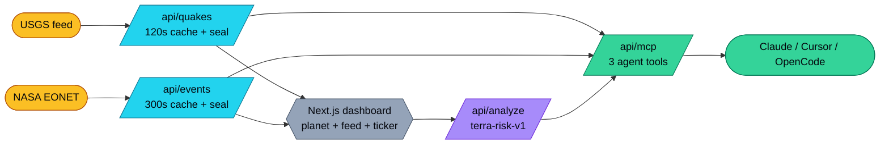
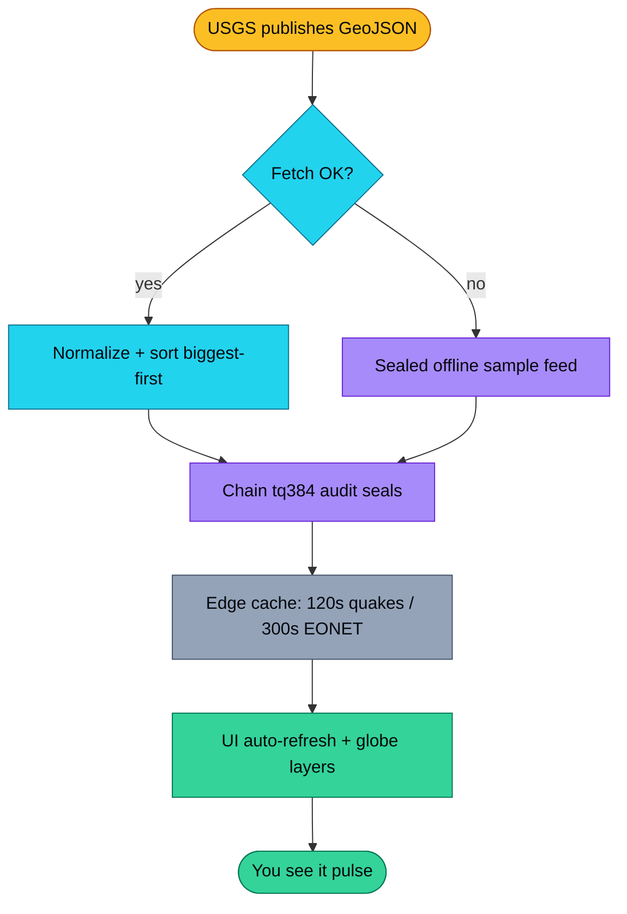
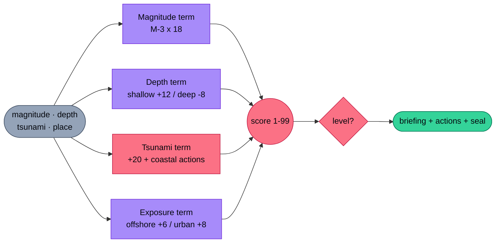
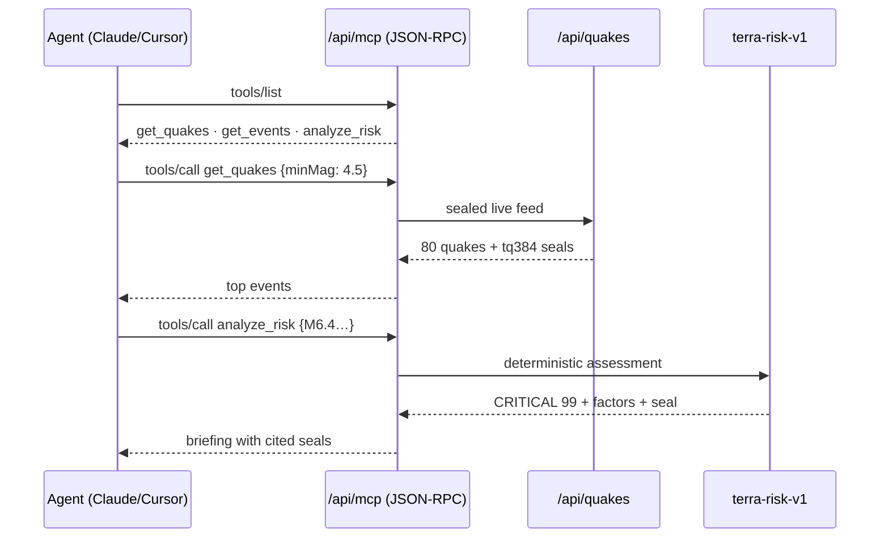
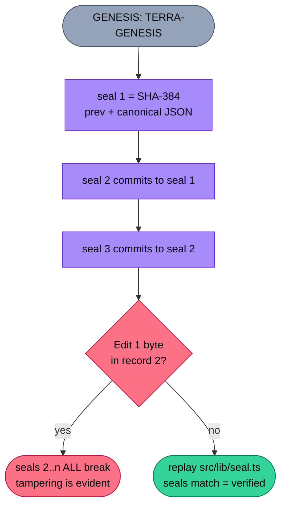
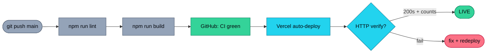
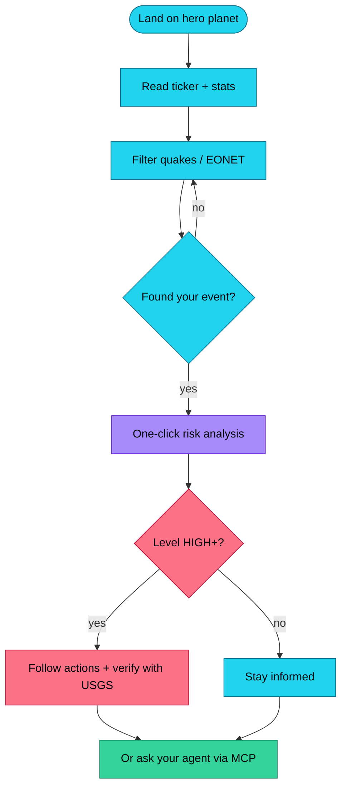
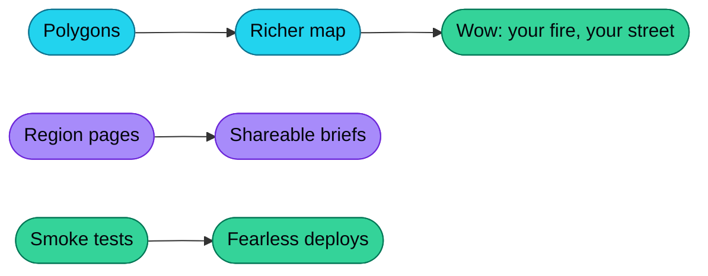
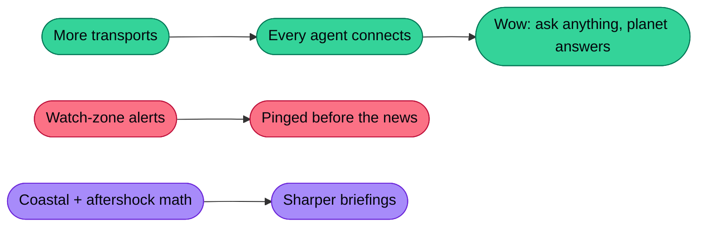
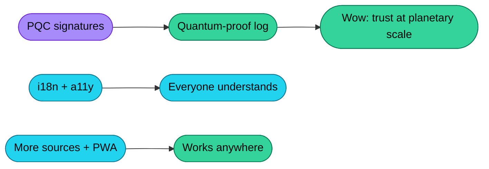

<div align="center">

# ◉ TERRA PULSE

### The planet has a pulse. Now you can hear it.

**Live earthquakes (USGS) + wildfires, storms & volcanoes (NASA EONET) → one open Next.js dashboard with a
WebGL planet, an explainable risk engine, a quantum-resilient audit seal, and an MCP server your coding agent can call.**

[](https://terra-pulse-sooty.vercel.app)
[](./LICENSE)
[](https://nextjs.org)
[](https://terra-pulse-sooty.vercel.app/api/mcp)
[](https://earthquake.usgs.gov/)
[](https://eonet.gsfc.nasa.gov/)

[Live App](https://terra-pulse-sooty.vercel.app) · [Quakes API](https://terra-pulse-sooty.vercel.app/api/quakes) · [MCP Endpoint](https://terra-pulse-sooty.vercel.app/api/mcp) · [Risk API](https://terra-pulse-sooty.vercel.app/api/analyze?magnitude=6.4&depthKm=18&tsunami=1) · [Report an issue](https://github.com/aniruddhaadak80/terra-pulse/issues)

</div>

> **Legend for every diagram below** — 🩵 cyan = live data · 🟣 violet = AI/engine · 💚 emerald = agents/verified ·
> 🟡 amber = external/caution · 🌹 rose = risk/alerts · ⬜ slate = infra.

---

## Why this exists

2026 set records nobody wanted: **5,480+ earthquakes ≥ M4.5** and **7,700+ wildfires, floods, storms and volcanic events**
in a single year, with record heatwaves across Europe, Asia, Africa and North America. Meanwhile every AI agent suddenly
speaks **MCP** — and every agent-to-tool hop is a new place for data to leak (the “harvest now, decrypt later” problem).

**Terra Pulse sits exactly at that intersection:**

| Real world 🌍 | What we built ⚡ |
|---|---|
| Record quakes, fires, storms — people need one calm screen | Live USGS + NASA feeds, biggest-first, searchable, tsunami flags surfaced |
| AI agents need live tools, not screenshots | `get_quakes` · `get_events` · `analyze_risk` over MCP-style JSON-RPC — no key, no signup |
| Black-box “AI risk scores” nobody trusts | Deterministic engine: every point of the 0–100 score is itemized |
| “Harvest now, decrypt later” quantum anxiety | Every record sealed into a SHA-384 hash chain (`tq384:`), PQC swap-in marked in code |

## ✨ Features

- 🌐 **WebGL planet** — `react-globe.gl` (Three.js): night-earth texture, quake points sized/colored by magnitude,
  ripple rings on the strongest events, animated sequence arcs, auto-rotate, click-through to USGS
- 📡 **Live ticker + stats** — strongest 24h, M4.5+ count, tsunami flags, open EONET events, auto-refresh every 2 min
- 🔎 **Quake explorer** — magnitude slider, place search, per-event detail with USGS deep-link + one-click risk analysis
- 🔥 **NASA EONET board** — wildfires / severe storms / volcanoes / floods with category filters
- 🧠 **Explainable risk engine** (`POST /api/analyze`) — magnitude × depth × tsunami × exposure → score, level,
  felt radius, factors, actions, briefing, seal
- 🤖 **MCP server** (`/api/mcp`) — `initialize` / `tools/list` / `tools/call` for Claude Code, Cursor, OpenCode
- ⛓️ **Seal chain** — `SHA-384(prevSeal ‖ canonicalJson)`, genesis `TERRA-GENESIS`, verifiable by replay
- 🎨 **Design system** — dark-first aurora UI, glass panels, Geist + Mono, marquee, section-numbered narrative,
  mobile responsive, zero env vars

## 🏗️ System architecture



## 🔄 Data-pipeline flow

How a tremor in Chile becomes a glowing dot on your screen in under two minutes:



## 🧠 Risk-engine flow

`src/lib/risk.ts` — one function serves the UI, the REST API, and the MCP tool:



Level bands: LOW <25 · GUARDED <45 · ELEVATED <65 · HIGH <85 · CRITICAL ≥85.
Felt radius: `min(1500, max(5, 10 × 2^(M−4)))` km.

## 🤖 Agent (MCP) sequence

What happens when your coding agent asks about the planet:



## ⛓️ Seal-chain integrity



SHA-384 keeps a 192-bit margin under Grover-style quantum search; the ML-DSA (Dilithium) signature
swap-in point is marked in code for the post-quantum upgrade.

## 🚀 Deployment pipeline

Push to `main` and Vercel ships it — the same gates run locally and in CI:



## 🧭 User-journey flow



## 🗺️ Roadmap

### Phase 1 — Now: deepen the signal (in progress)

- [ ] Polygon rendering for EONET fire/flood perimeters (currently points)
- [ ] Per-region pages (`/region/[id]`) with shareable risk briefings
- [ ] Playwright smoke tests: globe mounts, feed renders, MCP round-trip



### Phase 2 — Next: agent-native planet

- [ ] MCP streamable-HTTP transport + tool schemas for more clients
- [ ] Alert subscriptions: agent-notified when M6+ or tsunami flag appears in your watch zone
- [ ] Coastal-distance estimator + aftershock-decay notes in the engine



### Phase 3 — Later: hardened + global

- [ ] ML-DSA-65 signature envelope on the seal chain (swap-in marked in `src/lib/seal.ts`)
- [ ] i18n safety actions (10 languages) + light mode + reduced-motion pass
- [ ] GDACS/NOAA sources, OG image generator, PWA offline briefings



## 🚀 Quickstart (Next.js)

```bash
git clone https://github.com/aniruddhaadak80/terra-pulse.git
cd terra-pulse
npm install
npm run dev        # http://localhost:3000
```

Production:

```bash
npm run build && npm start
```

No environment variables required. Sealed offline samples keep the UI, build, and demo alive with no network.
Why Next.js: App Router pages + API routes + edge caching + metadata/SEO live in one deployable unit —
no separate backend, no CORS hacks, one `vercel --prod` ships everything.

## 🔌 Use it as an API

```bash
# Live quakes (biggest first, sealed)
curl https://terra-pulse-sooty.vercel.app/api/quakes | head -c 600

# Open NASA events
curl https://terra-pulse-sooty.vercel.app/api/events | head -c 600

# Risk briefing (GET or POST)
curl 'https://terra-pulse-sooty.vercel.app/api/analyze?magnitude=6.4&depthKm=18&tsunami=1&place=Offshore%20Maule,%20Chile'
```

## 🤖 Give your agent a live planet

Paste into `mcp.json` (Claude Code / Cursor / OpenCode):

```json
{ "mcpServers": { "terra-pulse": { "url": "https://terra-pulse-sooty.vercel.app/api/mcp" } } }
```

Then ask: *“What were the strongest earthquakes in the last 24h, and what's the risk briefing for the biggest one?”*
— the agent calls `get_quakes` → `analyze_risk` and cites the `tq384:` seals. Try it without any agent via the
**Live Agent Console** on the site.

Raw JSON-RPC also works:

```bash
curl -X POST https://terra-pulse-sooty.vercel.app/api/mcp \
  -H 'content-type: application/json' \
  -d '{"jsonrpc":"2.0","id":1,"method":"tools/list"}'
```

## 📁 Project map

```
src/
  app/
    page.tsx                 # hero + WebGL planet + ticker + all sections
    layout.tsx               # metadata + fonts + theme
    api/quakes/route.ts      # USGS proxy (120s cache, sealed, offline fallback)
    api/events/route.ts      # EONET proxy (300s cache, sealed, offline fallback)
    api/analyze/route.ts     # risk engine (GET + POST)
    api/mcp/route.ts         # MCP-style JSON-RPC (initialize/list/call)
    api/health/route.ts      # health check
  components/
    PlanetGlobe.tsx          # react-globe.gl WebGL planet (points/rings/arcs) + error boundary
    GlobeCanvas.tsx          # lightweight canvas fallback if WebGL lib fails
    LiveDashboard.tsx        # quake explorer + EONET board
    Analyzer.tsx             # risk engine UI
    McpDocs.tsx              # agent setup + live console
    SealStrip.tsx            # audit-chain visualizer
    chrome.tsx               # navbar + ticker + stats + footer
  lib/
    risk.ts                  # deterministic risk engine
    seal.ts                  # tq384 hash chain
    types.ts                 # shared types
    fallback.ts              # offline sample feeds
```

## 🛡️ Disclaimers

Automated briefings are informational, not official warnings. Always verify with the
[USGS event page](https://earthquake.usgs.gov/) and your local disaster agency before acting.

## 🤝 Contributing

PRs welcome — see [CONTRIBUTING.md](./CONTRIBUTING.md). The roadmap above is the fastest way to find a high-impact first issue.

## 📜 License

MIT — see [LICENSE](./LICENSE). Data © USGS / NASA EONET (their terms apply to the feeds).
Globe rendering via [react-globe.gl](https://github.com/vasturiano/react-globe.gl) (MIT) + night-earth texture from
`three-globe` examples (CDN, falls back to a dark globe offline).

## 🙏 Acknowledgments

- [USGS Earthquake Hazards Program](https://earthquake.usgs.gov/) for the real-time feed
- [NASA EONET](https://eonet.gsfc.nasa.gov/) for open natural-event data
- [vasturiano](https://github.com/vasturiano) for the globe.gl ecosystem powering the planet
- The MCP community for the agent-interop pattern

---

<div align="center">

**If the planet is talking, the code should be open. ⭐ Star it, fork it, stay safe.**

</div>
