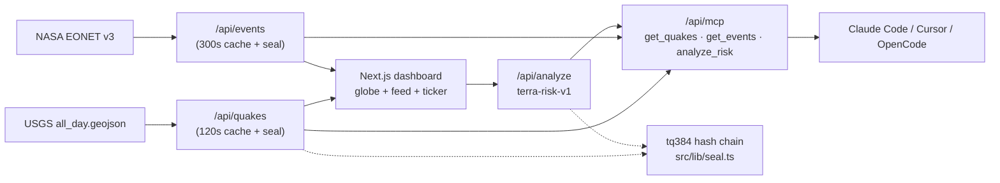

<div align="center">

# ◉ TERRA PULSE

### The planet has a pulse. Now you can hear it.

**Live earthquakes (USGS) + wildfires, storms & volcanoes (NASA EONET) → one open dashboard with an explainable risk engine, a quantum-resilient audit seal, and an MCP server your coding agent can call.**

[](https://terra-pulse.vercel.app)
[](./LICENSE)
[](https://nextjs.org)
[](https://terra-pulse.vercel.app/api/mcp)
[](https://earthquake.usgs.gov/)
[](https://eonet.gsfc.nasa.gov/)

[Live App](https://terra-pulse.vercel.app) · [MCP Endpoint](https://terra-pulse.vercel.app/api/mcp) · [Quakes API](https://terra-pulse.vercel.app/api/quakes) · [Risk API](https://terra-pulse.vercel.app/api/analyze?magnitude=6.4&depthKm=18&tsunami=1) · [Report an issue](https://github.com/aniruddhaadak80/terra-pulse/issues)

</div>

---

## Why this exists

2026 set records nobody wanted: **5,480+ earthquakes ≥ M4.5** and **7,700+ wildfires, floods, storms and volcanic events** in a single year, with record heatwaves across Europe, Asia, Africa and North America. Meanwhile every AI agent suddenly speaks **MCP** — and every agent-to-tool hop is a new place for data to leak (the “harvest now, decrypt later” problem).

**Terra Pulse sits exactly at that intersection:**

| Real world 🌍 | What we built ⚡ |
|---|---|
| Record quakes, fires, storms — people need one calm screen | Live USGS + NASA feeds, biggest-first, searchable, tsunami flags surfaced |
| AI agents need live tools, not screenshots | `get_quakes` · `get_events` · `analyze_risk` over MCP-style JSON-RPC — no key, no signup |
| Black-box “AI risk scores” nobody trusts | Deterministic engine: every point of the 0–100 score is itemized |
| “Harvest now, decrypt later” quantum anxiety | Every record sealed into a SHA-384 hash chain (`tq384:`), PQC swap-in marked in code |

## ✨ Features

- 🌐 **Planetary globe** — canvas-rendered rotating scope with live quake pulses (no WebGL dependency, 60fps, SSR-safe)
- 📡 **Live ticker + stats** — strongest 24h, M4.5+ count, tsunami flags, open EONET events, auto-refresh every 2 min
- 🔎 **Quake explorer** — magnitude slider, place search, per-event detail with USGS deep-link + one-click risk analysis
- 🔥 **NASA EONET board** — wildfires / severe storms / volcanoes / floods with category filters
- 🧠 **Explainable risk engine** (`POST /api/analyze`) — magnitude × depth × tsunami × exposure → score, level, felt radius, factors, actions, briefing, seal
- 🤖 **MCP server** (`/api/mcp`) — `initialize` / `tools/list` / `tools/call` for Claude Code, Cursor, OpenCode
- ⛓️ **Seal chain** — `SHA-384(prevSeal ‖ canonicalJson)`, genesis `TERRA-GENESIS`, verifiable by replaying `src/lib/seal.ts`
- 🎨 **Design system** — dark-first aurora UI, glass panels, Geist + Mono, marquee, command-feel nav, mobile responsive

## 🏗️ Architecture



## 🚀 Quickstart

```bash
git clone https://github.com/aniruddhaadak80/terra-pulse.git
cd terra-pulse
npm install
npm run dev        # http://localhost:3000
```

Production:

```bash
npm run build && npm start
```

No environment variables required. The app works fully offline via built-in sample feeds.

## 🔌 Use it as an API

```bash
# Live quakes (biggest first, sealed)
curl https://terra-pulse.vercel.app/api/quakes | head -c 600

# Open NASA events
curl https://terra-pulse.vercel.app/api/events | head -c 600

# Risk briefing (GET or POST)
curl 'https://terra-pulse.vercel.app/api/analyze?magnitude=6.4&depthKm=18&tsunami=1&place=Offshore%20Maule,%20Chile'
```

## 🤖 Give your agent a live planet

Paste into `mcp.json` (Claude Code / Cursor / OpenCode):

```json
{ "mcpServers": { "terra-pulse": { "url": "https://terra-pulse.vercel.app/api/mcp" } } }
```

Then ask: *“What were the strongest earthquakes in the last 24h, and what's the risk briefing for the biggest one?”* — the agent calls `get_quakes` → `analyze_risk` and cites the `tq384:` seals.

Raw JSON-RPC also works:

```bash
curl -X POST https://terra-pulse.vercel.app/api/mcp \
  -H 'content-type: application/json' \
  -d '{"jsonrpc":"2.0","id":1,"method":"tools/list"}'
```

## ⛓️ The seal chain (30-second version)

```ts
seal = "tq384:" + SHA384(prevSeal + "|" + canonicalJson(record)).slice(0, 48)
```

- Change any byte of any record → its seal changes → every later seal breaks. Tampering is evident.
- SHA-384 keeps a 192-bit margin under Grover-style quantum search.
- `src/lib/seal.ts` marks the ML-DSA (Dilithium) signature swap-in point for a future PQC upgrade.
- Verify: refetch `/api/quakes`, replay `sealChain()` — seals must match.

## 🧠 The risk engine (auditable by design)

`src/lib/risk.ts` — `assessRisk({ magnitude, depthKm, tsunami, place })`:

- Magnitude: `(M − 3) × 18`, capped — the dominant term, with TNT-equivalent detail
- Depth: shallow (<30 km) +12 · intermediate +4 · deep −2 · very deep −8
- Tsunami flag: +20 with coastal-evacuation actions
- Exposure: offshore/island +6 · dense-urban +8 · baseline +2
- Level: LOW <25 · GUARDED <45 · ELEVATED <65 · HIGH <85 · CRITICAL ≥85
- Radius: `min(1500, max(5, 10 × 2^(M−4)))` km · actions tailored per level

Same function serves the UI, the REST API, and the MCP tool — one source of truth.

## 📁 Project map

```
src/
  app/
    page.tsx              # hero + globe + ticker + all sections
    layout.tsx            # metadata + fonts + theme
    api/quakes/route.ts   # USGS proxy (120s cache, sealed, offline fallback)
    api/events/route.ts   # EONET proxy (300s cache, sealed, offline fallback)
    api/analyze/route.ts  # risk engine (GET + POST)
    api/mcp/route.ts      # MCP-style JSON-RPC (initialize/list/call)
    api/health/route.ts   # health check
  components/
    GlobeCanvas.tsx       # canvas planetary scope + live pulses
    LiveDashboard.tsx     # quake explorer + EONET board
    Analyzer.tsx          # risk engine UI
    McpDocs.tsx           # agent setup + live console
    SealStrip.tsx         # audit-chain visualizer
    chrome.tsx            # navbar + ticker + stats + footer
  lib/
    risk.ts               # deterministic risk engine
    seal.ts               # tq384 hash chain
    types.ts              # shared types
    fallback.ts           # offline sample feeds
```

## 🛡️ Disclaimers

Automated briefings are informational, not official warnings. Always verify with the [USGS event page](https://earthquake.usgs.gov/) and your local disaster agency before acting.

## 🤝 Contributing

PRs welcome — see [CONTRIBUTING.md](./CONTRIBUTING.md). Good first issues: more EONET geometry rendering, i18n of safety actions, ML-DSA envelope, Playwright smoke tests.

## 📜 License

MIT — see [LICENSE](./LICENSE). Data © USGS / NASA EONET (their terms apply to the feeds).

## 🙏 Acknowledgments

- [USGS Earthquake Hazards Program](https://earthquake.usgs.gov/) for the real-time feed
- [NASA EONET](https://eonet.gsfc.nasa.gov/) for open natural-event data
- The MCP community for the agent-interop pattern

---

<div align="center">

**If the planet is talking, the code should be open. ⭐ Star it, fork it, stay safe.**

</div>
